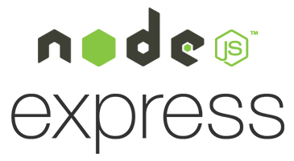
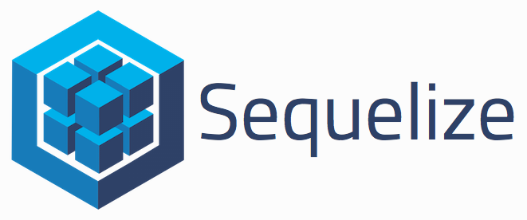
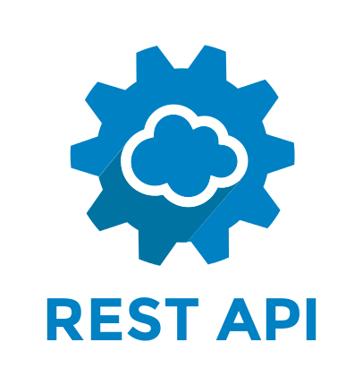
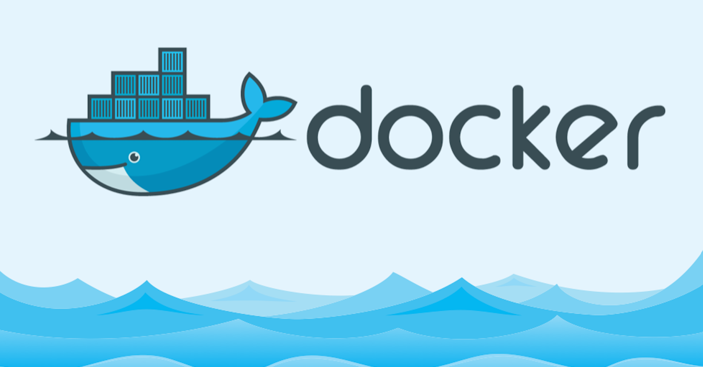
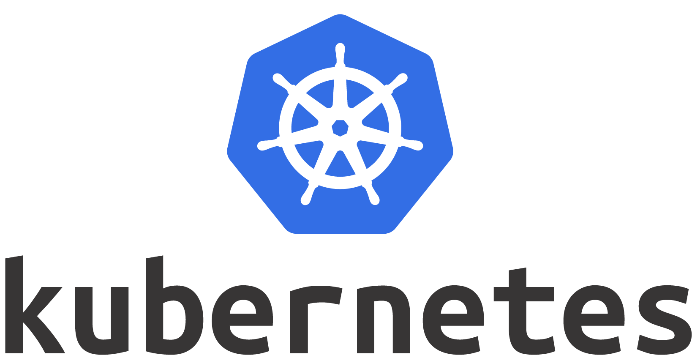

# Website

<!-- @import "[TOC]" {cmd="toc" depthFrom=2 depthTo=6 orderedList=false} -->
<!-- code_chunk_output -->

* [Architektur](#architektur)
	* [Frameworks](#frameworks)

<!-- /code_chunk_output -->

## Architektur

### Frameworks

- Stellt Serverlogik bereit
- Modular erweiterbar mit bestimmten Funktionalitäten
- Express stellt die Webframework Logik und Routing usw.

- Stellt die Datenbankverwaltung bereit
- JavaSript ORM Schnittstelle
- Würds nehmen weil ich damit schon Erfahrung habe
- Ist als NPM Paket erhältlich

- Rest bietet eine populäre API Schnittstelle
- Falls wir ne API brauchen würd ich einfach REST nehmen, weil ist einfach.

- Docker zum Modularisieren der einzelnen Komponenten
- Docker ist einfach und funktioniert
- Für meherere Container ist ``docker-compose`` empfehlenswert

- Kubernetes für Deployment und CI/CD Logik falls benötigt?
- Nur wenn wirs brauchen
